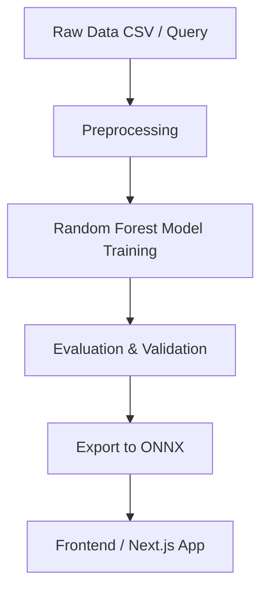

# Software Price Prediction Model

[](LICENSE)
[](#)
[](#)

---

> **One‑stop ML pipeline to estimate software development costs.** Clean, reproducible, ONNX‑exportable models with a minimal Docker environment and ready-to-plug frontend example.

---

## Table of Contents

1. [Quick Start](#quick-start)
2. [Project Overview](#project-overview)
3. [Features](#features)
4. [Architecture & Pipeline](#architecture--pipeline)
5. [Data Schema & Feature Mapping](#data-schema--feature-mapping)
6. [Training & Evaluation](#training--evaluation)
7. [Exporting to ONNX](#exporting-to-onnx)
8. [Frontend Integration (Next.js)](#frontend-integration-nextjs)
9. [Docker & Development Workflow](#docker--development-workflow)
10. [Examples](#examples)
11. [Tips & Troubleshooting](#tips--troubleshooting)
12. [Contributing](#contributing)
13. [Roadmap](#roadmap)
14. [License & Authors](#license--authors)

---

## Quick Start

Clone the repo and start the development container (recommended):

```bash
git clone https://github.com/OmniSoft-Limited/price-prediction-model.git
cd price-prediction-model
docker compose up --build
```

Open JupyterLab at `http://localhost:8888` and open `notebooks/01_train.ipynb` to run the full pipeline.

> Tip: The workspace folder is mounted at `/workspace` inside the container — your files persist locally.

---

## Project Overview

This repository contains a reproducible ML pipeline that:

* loads structured feature CSVs (or queries via DuckDB),
* applies a robust preprocessing pipeline for mixed categorical/numerical inputs,
* trains a Random Forest regressor with sensible defaults,
* evaluates model performance (R², MAE, RMSE),
* exports the final pipeline to ONNX for client-side inference.

The main goal is to enable **fast prototyping** and **production-ready** integration with web frontends (Next.js / onnxruntime-web).

---

## Features

* End-to-end sklearn `Pipeline` with feature transformers.
* Clear schema for business features (project type, modules, user scale, security, timeline, etc.).
* Random Forest Regressor with cross-validation utilities.
* Export/Import helpers — model -> ONNX, ONNX -> JS.
* Lightweight Docker Compose for development.
* Notebook-driven reproducibility and example Next.js client.

---

## Architecture & Pipeline



---

## Data Schema & Feature Mapping

The pipeline expects features in a consistent order. Below is the canonical schema and one‑hot / ordinal mapping notes.

### Canonical Feature List (order matters for ONNX export)

1. projectType: `Web` / `Mobile` / `Desktop` / `Hybrid`  → one-hot encoded  (4 columns)
2. industryDomain: multi-category (see list) → one-hot
3. numUsers: ordinal mapping — e.g. `1-5` -> 0, `6-10` -> 1, `11-50` -> 2, `50-100` -> 3, `100+` -> 4
4. targetMarket: `Local` / `Global` / `Both` → one-hot
5. platforms: multi-select flags → binary columns (iOS, Android, Web, Desktop, Tablet)
6. authentication: ordinal or one-hot (None, Basic login, Social login, SSO, MFA)
7. adminDashboard: None / Basic / Advanced / Professional → ordinal (0..3)
8. modules_count: integer (estimated number of distinct modules)
9. uiUxDesign: Simple / Custom / Advanced → ordinal (0..2)
10. performance: Basic / Medium / High → ordinal (0..2)
11. securityCompliance: Standard / High-security / Regulatory → ordinal (0..2)
12. availability: Normal / 24/7 → binary
13. timeline: Flexible / 1-3m / 3-6m / 6-12m / Urgent → ordinal (0..4)
14. extra_features: vector of booleans (Search, Reporting, Offline, File handling, AI/ML)
15. thirdPartyIntegrations: integer (count of major 3rd-party services)
16. dataMigration: Yes / No → binary
17. accessibility: Yes / No → binary
18. budgetRange: categorical (used as auxiliary signal only)

> **Important:** The ONNX model input is a fixed-size float array. The notebook `notebooks/onnx_input_mapping.md` contains the exact vector order used during export. Always use that mapping when calling the ONNX model from JS.

---

## Training & Evaluation

High-level steps in the training notebook:

1. Load CSV via DuckDB (fast queries & filtering).
2. Split into train/test with stratification if needed.
3. Build preprocessing pipeline:

   * numerical imputer + StandardScaler
   * categorical imputer + OneHotEncoder (handle_unknown='ignore')
   * feature union to produce final numeric matrix
4. Fit `RandomForestRegressor(n_estimators=200, n_jobs=-1, random_state=42)`
5. Evaluate with `r2_score`, `mean_absolute_error`, `mean_squared_error` and report feature importances.

### Example evaluation output

```
R2 (test): 0.78
MAE (test): 4,200
RMSE (test): 6,500
```

> These numbers are illustrative — your dataset and feature engineering choices will change results.

---

## Exporting to ONNX

The repo contains `scripts/export_to_onnx.py` which wraps `skl2onnx` conversion. Basic usage:

```bash
python scripts/export_to_onnx.py --model-path models/rf_pipeline.pkl --out models/software_price.onnx
```

**ONNX input details**

* Input name: `float_input`
* Shape: `[1, N]` where `N` is the fixed number of float features after preprocessing
* dtype: `float32`

**Quick Python test**

```python
import onnxruntime as ort
import numpy as np

sess = ort.InferenceSession('models/software_price.onnx')
# example feature vector (float32) - adjust to match onnx input length
x = np.array([0.0, 1.0, 0.0,  ...], dtype=np.float32).reshape(1, -1)
res = sess.run(None, {'float_input': x})
print('Predicted cost:', res[0][0])
```

---

## Frontend Integration (Next.js + onnxruntime-web)

A small example is included at `frontend/nextjs-demo`.

### Example client code (improved)

```javascript
import * as onnx from 'onnxruntime-web';

export async function predictPrice(featureFloat32Array) {
  const session = await onnx.InferenceSession.create('/software_price.onnx');
  const inputTensor = new onnx.Tensor('float32', featureFloat32Array, [1, featureFloat32Array.length]);
  const outputMap = await session.run({ float_input: inputTensor });
  // The exported ONNX output name may vary; check the model metadata or use the first key
  const outputName = Object.keys(outputMap)[0];
  return outputMap[outputName].data[0];
}
```

#### Example mapping helper (JS)

```javascript
// frontend/utils/mapToFeatureArray.js
export function mapFormToFloatArray(formData) {
  // Return a Float32Array that matches the exact order described in notebooks/onnx_input_mapping.md
  const arr = [/* 0/1 flags and floats in exact order */];
  return new Float32Array(arr);
}
```

---

## Docker & Development Workflow

`docker-compose.yml` contains three services:

* `app` — JupyterLab + training scripts
* `worker` — optional CPU worker to run batch training or export
* `frontend` — static preview server for Next.js demo (optional)

### Example `docker compose` commands

```bash
# Build and start the whole workspace
docker compose up --build

# Rebuild just the app
docker compose up --build app

# Run a one-off export inside container
docker compose run --rm app python scripts/export_to_onnx.py --model-path models/rf_pipeline.pkl --out models/software_price.onnx
```

---


### Example: call ONNX from Python (server-side inference)

```python
import onnxruntime as ort
import numpy as np

sess = ort.InferenceSession('models/software_price.onnx')
arr = np.load('examples/example_input.npy')  # shape (1, N)
print(sess.run(None, {'float_input': arr})[0])
```

---

## Tips & Troubleshooting

* **ONNX shape mismatch**: confirm the input vector length and ordering. Use `netron` or `onnxruntime` to inspect model inputs.
* **Categorical unseen values**: OneHotEncoder is set with `handle_unknown='ignore'` in the pipeline but will change column order if you rebuild encoders — always export the pipeline used for inference.
* **Floating point drift**: small discrepancies between sklearn predictions and ONNX outputs may happen; check `skl2onnx` conversion warnings.

---

## Contributing

Contributions are welcome — please follow these steps:

1. Fork the repository
2. Create a feature branch: `git checkout -b feat/your-feature`
3. Open a PR with a clear description and tests (unit tests for preprocessing + integration for ONNX are highly appreciated)

Please follow the code style and add notebook-based reproducibility for new features.

---

## Roadmap

* [ ] More advanced models (Gradient Boosting, LightGBM) with ONNX export
* [ ] AutoML experiments and hyperparameter sweep notebook
* [ ] CI checks for `export_to_onnx.py` to make sure exported models are runnable by onnxruntime-web
* [ ] Add example deployments (serverless) showing low-latency inference

---

## License & Authors

MIT License — see [LICENSE](LICENSE).

**Authors:**

* Tahcin Ul Karim (Mycin) — maintainer
* Mehedi Hasan Shomik 