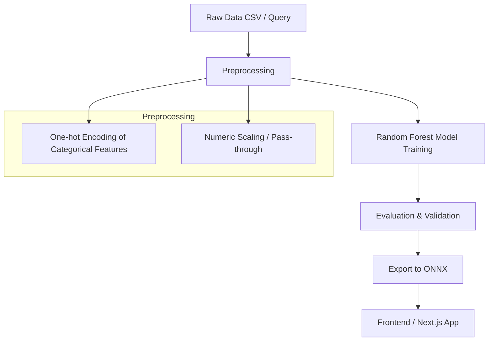

# Software Price Prediction ML Pipeline

[](LICENSE)

## Table of Contents

1. [Overview](#overview)
2. [Features](#features)
3. [Tech Stack](#tech-stack)
4. [Architecture & Pipeline](#architecture--pipeline)
5. [Data](#data)
6. [Setup & Docker Usage](#setup--docker-usage)
7. [Model Training & Export](#model-training--export)
8. [Frontend Integration](#frontend-integration)
9. [License](#license)

---

## Overview

This project provides a **Machine Learning pipeline** to predict the **estimated development cost** of a software project based on a comprehensive set of requirements.

---

## Features

* Predicts software development cost based on structured features.
* Handles **categorical + numeric features**.
* Includes **preprocessing pipeline** for clean feature handling.
* Uses **Random Forest Regressor** for high accuracy.
* Exports models to **ONNX** for **Next.js / JS frontend**.
* Minimal, reproducible **Docker environment**.

---

## Tech Stack

**Python Environment:**

* Python 3.11
* `numpy`, `pandas` — data manipulation
* `scikit-learn` — ML models & pipelines
* `matplotlib`, `seaborn` — visualization
* `duckdb` — fast CSV/SQL querying
* `jupyterlab` — interactive notebooks
* `skl2onnx` + `onnxruntime` — model export & inference

**Frontend (Optional):**

* Next.js with **`onnxruntime-web`**

**Containerization:**

* Docker using **Python 3.11-slim**

---

## Architecture & Pipeline

### ML Pipeline (Mermaid Diagram)



---

### Steps Explained

1. **Load Dataset**: Includes all schema features (software type, modules, dashboard complexity, team size, etc.)
2. **Preprocessing**:

   * One-hot encode categorical features
   * Numeric features passed through
3. **Model Training**: Random Forest Regressor
4. **Evaluation**: R² score and optional cross-validation
5. **Export Model**: ONNX for JS frontend integration

---

### Frontend Integration (Next.js Example)

```javascript
import * as onnx from 'onnxruntime-web';

async function predictPrice(inputArray) {
  const session = await onnx.InferenceSession.create('/software_price.onnx');
  const inputTensor = new onnx.Tensor('float32', inputArray, [1, inputArray.length]);
  const output = await session.run({ float_input: inputTensor });
  return output['variable_name'].data[0];
}
```

---

### Data Features

#### Basic Info:
  - projectName: string
  - softwareType: Web | Mobile | Desktop | Hybrid/Cloud
  - industryDomain: 
      E-commerce | Education/EdTech | Healthcare | FinTech | Social Networking 
      | Content Management | Restaurant Management | Hotel Management 
      | Logistics | Travel | Other

#### Target Audience & Scale:
  - numUsers: 1-5 | 6-10 | 11-50 | 50-100 | 100+
  - targetMarket: Local | Global | Both
  - targetPlatforms: iOS | Android | Web | Desktop | Tablet/Smart Devices

#### Core Features & Modules:
  - authentication: None | Basic login | Social login | Enterprise SSO | Multi-factor authentication
  - adminDashboard: None | Basic | Advanced | Professional
  - ecommerce: Product catalog | Cart & Checkout | Payment gateway | Shipping & Inventory
  - contentManagement: Blog/News | Pages & Media uploads | Workflow
  - communicationFeatures: Notifications | Messaging/Chat | Real-time updates
  - extraFeatures: Search & Filters | Reporting & Analytics | Offline mode | File/media handling | AI/ML module

#### Integrations & APIs:
  - integrationCount: None | 1-3 | 4-10 | 10+
  - thirdPartyServices: Payment gateways | Maps/GPS | Email/SMS | Analytics | Other
  - dataMigration: Yes | No

#### Design & User Experience:
  - uiUxDesign: Simple | Custom | Advanced
  - accessibility: Yes | No
  - multiLanguageSupport: None | 2-3 | 3-10 | 10+

#### Quality & Non-Functional Requirements:
  - performance: Basic | Medium | High
  - securityCompliance: Standard | High-security | Regulatory compliance
  - availability: Normal | 24/7 uptime

#### Technology Preferences:
  - frontend: React | Angular | Vue | Other
  - backend: Node.js | Django | Laravel | Go | Other
  - mobile: Flutter | React Native | Swift | Kotlin | Other
  - database: MySQL | PostgreSQL | MongoDB | Firebase | Other
  - hosting: Cloud | On-premise | Shared

#### Team & Timeline:
  - teamSize: 1-3 devs | 3-5 devs | 5-10 devs | 10+ devs
  - additionalRoles: UI/UX Designers | QA Testers | DevOps Engineers | Business Analysts
  - timeline: Flexible | 1-3 months | 3-6 months | 6-12 months | Urgent

#### Budget & Location Factors:
  - developmentLocation: Local team | Global/Remote team | No preference
  - budgetRange: < $5k | $5k-$20k | $20k-$100k | $100k+

---

## Setup & Docker Usage

### Build Docker image

```bash
docker build -t ml-price-predictor .
```

### Run container (mount current dir)

```bash
docker run -it -p 8888:8888 -v $(pwd):/workspace ml-price-predictor
```

* Local directory accessible inside `/workspace`.
* JupyterLab at `http://localhost:8888`.

---

## Model Training & Export

1. Open **JupyterLab** in container.
2. Run training script: `ml_pipeline.py`.
3. Pipeline automatically:

   * Preprocesses features
   * Trains Random Forest
   * Exports `software_price.onnx`
4. Test ONNX model in Python:

```python
import onnxruntime as ort
import numpy as np

session = ort.InferenceSession("software_price.onnx")
input_array = np.array([ ... ], dtype=np.float32).reshape(1, -1)
result = session.run(None, {"float_input": input_array})
print(result[0])
```

---


## License

MIT License – see [LICENSE](LICENSE).
